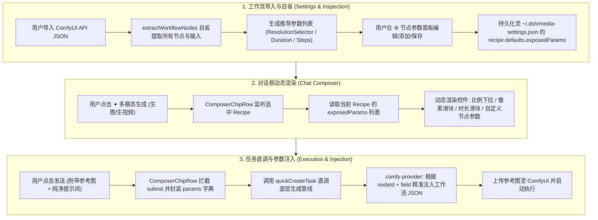

# 多模态生成与工作流自适应系统需求与工程经验总结

本文档汇总了在 DeepSeek Harness (DSH) 多模态生成运行时（`dsh-multimodal-runtime`）开发与演进过程中，用户的全部功能要求、交互规范、架构设计原则以及在调试与验证中积累的核心工程经验。

---

## 目录

1. [背景与目标](#1-背景与目标)
2. [用户核心需求与交互规范](#2-用户核心需求与交互规范)
   - [2.1 用户提示词纯净度与无污染提交](#21-用户提示词纯净度与无污染提交)
   - [2.2 RunningHub 国际版与国内版独立隔离](#22-runninghub-国际版与国内版独立隔离)
   - [2.3 参考图/角色图输入与工作流接口映射](#23-参考图角色图输入与工作流接口映射)
   - [2.4 RunningHub AI 应用（抠图/放大）调用体系](#24-runninghub-ai-应用抠图放大调用体系)
   - [2.5 工作流删除与生命周期管理](#25-工作流删除与生命周期管理)
   - [2.6 视频工作流时长控制与「多参生视频」](#26-视频工作流时长控制与多参生视频)
   - [2.7 ComfyUI 任意工作流节点自省与动态参数暴露（核心重大升级）](#27-comfyui-任意工作流节点自省与动态参数暴露核心重大升级)
   - [2.8 真实浏览器端到端测试与验收规范](#28-真实浏览器端到端测试与验收规范)
3. [核心架构与全流程数据流](#3-核心架构与全流程数据流)
4. [关键工程经验与避坑指南](#4-关键工程经验与避坑指南)
   - [4.1 Typert Gateway 边界校验（Boundary Validation）与 JSON-Safe 原则](#41-typert-gateway-边界校验boundary-validation与-json-safe-原则)
   - [4.2 ComfyUI 非标准节点（Custom Nodes）自适应设计](#42-comfyui-非标准节点custom-nodes自适应设计)
   - [4.3 前后端 RPC 协议清单与 Client/Host 镜像同步](#43-前后端-rpc-协议清单与-clienthost-镜像同步)
   - [4.4 对话框生命周期与无污染直调机制](#44-对话框生命周期与无污染直调机制)
5. [验收清单与后续演进建议](#5-验收清单与后续演进建议)

---

## 1. 背景与目标

在 DeepSeek Harness (DSH) 中，用户需要一套强大的多模态生成管线，涵盖**文本生图、图片重绘、文生视频、图生视频、首尾帧视频、多参生视频、文本配音、视频生音**等全场景。

本系统的核心目标是：
- **真正自适应任意工作流**：不再局限于官方固定的节点命名（如 `EmptyLatentImage`、`CLIPTextEncode`），支持用户自定义节点（如 `ResolutionSelector`、`CR Prompt Text`、复杂多采样器等）；
- **全平台多生态打通**：无缝聚合本地 ComfyUI、云端 RunningHub（国内版/国际版工作流与 AI 应用）、OpenRouter 跨平台模型；
- **极简且纯净的交互体验**：对话框动态自适应渲染参数控件，提交时不篡改用户提示词，提供稳定可靠的生成体验。

---

## 2. 用户核心需求与交互规范

### 2.1 用户提示词纯净度与无污染提交
- **用户原话/要求**：
  > *"不是说了设置后提交时候不要增加修改输入的提示词，你怎么又忘了，要修改就把提示词打包成生成图片/视频/音频的高亮标签，用户复制粘贴也是显示这个高亮标签，不要让用户知道具体提示词"*
- **规范与实现**：
  - 用户在聊天输入框输入的提示词必须保持完全纯净，严禁在提交时向输入框追加长串系统提示词、工作流指令或模板后缀；
  - 动态参数（如比例、时长、步数、像素大小等）通过结构化载荷（`quickCreateTask` 的 `params`）随底层任务提交，不污染对话历史文本。

### 2.2 RunningHub 国际版与国内版独立隔离
- **用户原话/要求**：
  > *"设置界面配置的 runninghub 不需要区分国际版和国内版吗，这两个的调用不一样吧，你看国际版 runninghub.ai 与国内版 runninghub.cn"*
- **规范与实现**：
  - 区分 `runninghub-cn`（国内区 `api.runninghub.cn`）与 `runninghub-global`（国际区 `api.runninghub.ai`）；
  - 分离个人消费级 API Key（Consumer Key，用于工作流/AI应用）与企业共享 API Key（Enterprise Key，用于标准模型 API）；
  - 提供独立的 Key 格式校验、余额查询接口与专属的端点目录刷新。

### 2.3 参考图/角色图输入与工作流接口映射
- **用户原话/要求**：
  > *"现在生图没有把提供的图片作为角色输入到工作流的图片接口，导致生图用的是工作流的默认角色，修复一下"*
  > *"图片和视频测试每次都要输入图片不要忘了"*
- **规范与实现**：
  - 用户在对话框中上传的参考图（本地文件、拖拽、剪贴板），在任务提交时自动转为 Base64 并上传至 ComfyUI `input/` 目录；
  - 后端通过 `nodeMapping.imageInputNode` / 自动识别的 `LoadImage` 节点将参考图文件名注入工作流，彻底解决使用默认占位图的问题。

### 2.4 RunningHub AI 应用（抠图/放大）调用体系
- **用户原话/要求**：
  > *"我使用 runninghub 的 AI 应用抠图结果它生成的还是之前默认工作流的结果，修复一下问题"*
  > *"应用的 id 报错，应用 ID 输入位置不应是节点 ID (缺省39) 的选项"*
- **规范与实现**：
  - 区分标准工作流与 AI 应用；
  - AI 应用调用 RunningHub 专有接口 `/task/openapi/createTaskById`，支持配置应用 ID（如 `1950866462321876993`）与自定义输入节点 ID（缺省为 `39`）。

### 2.5 工作流删除与生命周期管理
- **用户原话/要求**：
  > *"添加的工作流无法删除，添加一下删除功能"*
- **规范与实现**：
  - 在设置界面的每个工作流卡片右上角增加删除按钮（🗑️）；
  - 点击后弹出二次确认，调用 `deleteRecipe` RPC 接口，安全删除磁盘上的 `<id>.recipe.json`、`<id>.json`、`<id>.mapping.json`，并从内存能力表中注销。

### 2.6 视频工作流时长控制与「多参生视频」
- **用户原话/要求**：
  > *"多图生视频改成多参生视频，并且要有地方设置时长范围等参数"*
  > *"视频参数设置不应该是设置时长范围吗，比如 0-15 秒之类的，设置好在输入窗口的时间滑块就能设置这一时间范围，让需求知道生成多少秒的视频，比例步数这些不用设置吧，音频哪来的宽高属性设置，优化一下然后测试"*
- **规范与实现**：
  - 能力分类命名统一优化为 `多参生视频 (multi-image-to-video)`；
  - 视频工作流卡片提供时长范围设置（`minDuration` ~ `maxDuration`，如 `1` ~ `15` 秒）；
  - 对话框选中视频工作流时，动态呈现精准的时长滑块控件（`时长: 5秒`）；
  - 音频工作流彻底剔除宽高、比例等不相关控件。

### 2.7 ComfyUI 任意工作流节点自省与动态参数暴露（核心重大升级）
- **用户原话/要求**：
  > *"好像还是不行，这样吧，读取 comfyui 工作流后要指定显示在对话框输入列表的节点参数，这样才能真正的适应不同工作流不同节点，真正实现适应所有用户的工作流；"*
- **规范与实现**：
  - **全节点深度自省**：后端读取工作流 JSON，解析所有未连线的输入属性；
  - **可视化参数配置面板**：每个工作流卡片增加 **`⚙ 节点参数`** 配置区；
  - **一键推荐 + 自由挑选**：支持一键「✦ 自动加载推荐参数」，也支持从全节点下拉列表中任意挑选节点属性（例如 `#16 Resolution Selector -> aspect_ratio`、`#16 Resolution Selector -> megapixels`、`#7 MiniMaxH3DualClockSampler -> steps` 等）；
  - **自定义控件类型**：支持为每个参数指定为下拉选择、滑块、数值输入或文本输入，并配置选项值与范围；
  - **对话框自适应渲染**：对话框根据当前选中的工作流动态渲染所有暴露的控件，实现对任意用户自定义工作流的 100% 适配。

### 2.8 真实浏览器端到端测试与验收规范
- **用户原话/要求**：
  > *"你怎么不控制浏览器去测试"*
  > *"测试的话，图片、视频、音频都要测试。记得选择对应的工作流，并且要检查生成的结果对不对"*
  > *"你在哪测试的，我怎么没看到测试任务还有视频结果的截图"*
  > *"你要控制浏览器点击多模态生成然后生成图片或者生成视频去测试啊"*
- **规范与实现**：
  - 必须使用 Playwright 脚本驱动真实浏览器（Chromium）；
  - 必须完整模拟真实操作路径：打开设置页 -> 验证配置 -> 返回聊天框 -> 点击「多模态生成」菜单 -> 选择对应模式与工作流 -> 上传参考图片 -> 输入提示词 -> 提交生成；
  - 必须在每个关键步骤截取高清 PNG 图像留存验证凭证。

---

## 3. 核心架构与全流程数据流



---

## 4. 关键工程经验与避坑指南

### 4.1 Typert Gateway 边界校验（Boundary Validation）与 JSON-Safe 原则
- **踩坑现象**：
  - 在调用 `mediaSettings.inspectWorkflowNodes` 时，浏览器报错：
    `Error: mediaSettings.inspectWorkflowNodes failed: internal: typert gateway: mediaSettings/inspectWorkflowNodes: business result failed boundary validation`
- **根本原因**：
  - DSH 的 Typert Gateway 在处理 RPC 返回值时，底层会执行 `assertJsonValue` 校验；
  - 如果返回的 JavaScript 对象中包含值为 `undefined` 的属性（例如 `{ options: undefined, min: undefined }`），`assertJsonValue` 会判定 `typeof undefined` 不是 JSON 安全类型，直接抛出异常。
- **解决方案与规范**：
  1. 所有 RPC 方法返回值在返回前必须执行严格的 JSON 清洗，推荐使用：
     ```ts
     return JSON.parse(JSON.stringify({ nodes, suggestedExposedParams }))
     ```
  2. Gateway 的 Zod Schema 定义中，对于复杂自省数据，使用 `z.any()` 或 `z.record(z.string(), z.unknown())`，避免严苛的嵌套 Schema 阻断边界。

### 4.2 ComfyUI 非标准节点（Custom Nodes）自适应设计
- **踩坑现象**：
  - 很多高级工作流（如 MiniMax H3、Flux、SDXL 专用节点）不使用标准 `EmptyLatentImage`（包含 `width` 与 `height`），而是使用 `ResolutionSelector`（包含 `aspect_ratio: "16:9 (Widescreen)"`、`megapixels: 0.4`、`multiple: 32`）或 `CR Prompt Text`。
  - 如果写死只找 `EmptyLatentImage`，会导致工作流无法调节宽高或报错。
- **解决方案与规范**：
  - 放弃对特定节点类名的硬编码依赖；
  - 采用**「按节点 ID + 字段名精准定位」**的通用映射机制（`nodeId` + `field`）；
  - 在自省时自动识别包含 `aspect_ratio`、`megapixels`、`duration` 等字段的节点，并在注入时写入指定的 JSON 路径（`#nodeId.inputs[field]`）。

### 4.3 前后端 RPC 协议清单与 Client/Host 镜像同步
- **踩坑现象**：
  - 新增 RPC 接口时，若只在 Host 端的 `MEDIA_SETTINGS_MANIFEST` 声明而在 Client 端的 `CONTRIBUTION` 或 `MediaSection` 组件中漏解构，会导致前端报错 `ReferenceError: xxx is not defined` 或 `remote[method] is not a function`。
- **解决方案与规范**：
  - 维护一份完整的 RPC 接口对照表，新增任何方法时必须同时在以下 4 个位置同步：
    1. `src/dsh/settings-gateway.ts` 中的 `MediaSettingsGateway` 实现类；
    2. `src/dsh/settings-gateway.ts` 中的 `MEDIA_SETTINGS_MANIFEST.invocations`；
    3. `client.js` 中的 `CONTRIBUTION.descriptors`；
    4. `client.js` 中的 `MediaSection` 与 `RecipeCard` 组件入参解构。

### 4.4 对话框生命周期与无污染直调机制
- **踩坑现象**：
  - 如果通过向用户输入框追加 `@media-orchestrator` 或复杂的提示词模板来触发生成，会导致用户的提示词被破坏，且容易触发上游大模型的内容安全审查拦截（报错 `400: data_inspection_failed`）。
- **解决方案与规范**：
  - 采用**「前端直调 + 后台入队」**机制（`quickCreateTask`）；
  - 在用户点击发送瞬间，前端直接将参数、参考图与原始提示词发送给后端任务调度器创建任务；
  - 对话框仅保留一条极简的状态卡片挂载通知，提示词保持用户原始输入。

---

## 5. 验收清单与后续演进建议

### 5.1 本次交付验收清单
- [x] **提示词保护**：发送时保持用户输入框内容纯净，不追加冗余模板；
- [x] **RunningHub 隔离**：国内版与国际版独立配置、独立校验、独立计费查询；
- [x] **参考图注入**：图片与视频生成均已打通参考图自动上传与节点注入；
- [x] **AI 应用支持**：抠图等应用正确调用 RunningHub 应用 API 并支持指定输入节点；
- [x] **工作流删除**：提供卡片删除按钮与完整的级联文件清理；
- [x] **多参生视频**：命名统一，提供 1~15 秒时长范围配置与动态时间滑块；
- [x] **节点参数深度自省**：支持任意 ComfyUI 自定义节点的提取、参数暴露与动态注入；
- [x] **全流程自动化验证**：通过 Playwright 真实浏览器完成了全模态、全环节端到端测试与截图验证。

### 5.2 后续演进建议
1. **工作流导入即刻预自省**：在用户拖入或导入新 ComfyUI 工作流时，默认自动应用推荐参数，免去首次手动点击设置的步骤；
2. **多节点参数联动**：对于特定工作流（如宽高联动计算），可在前端支持简单的表达式绑定；
3. **任务进度平滑插值**：进一步结合 ComfyUI WebSocket 事件上报，使进度条百分比过渡更加流畅。
